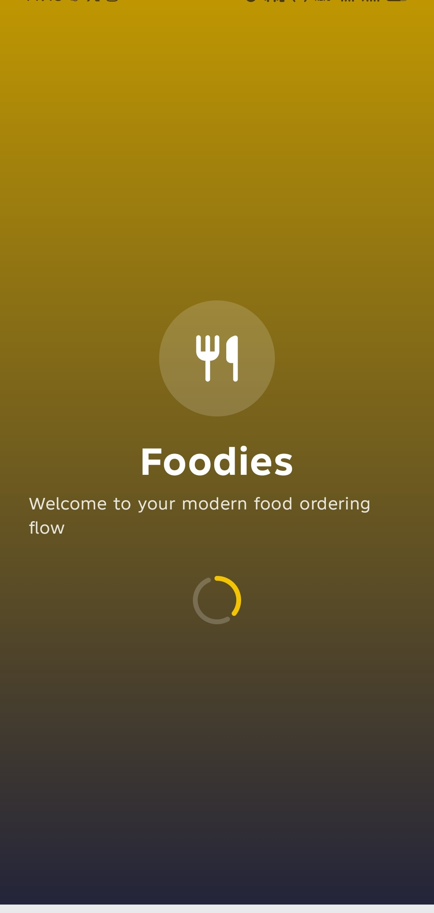
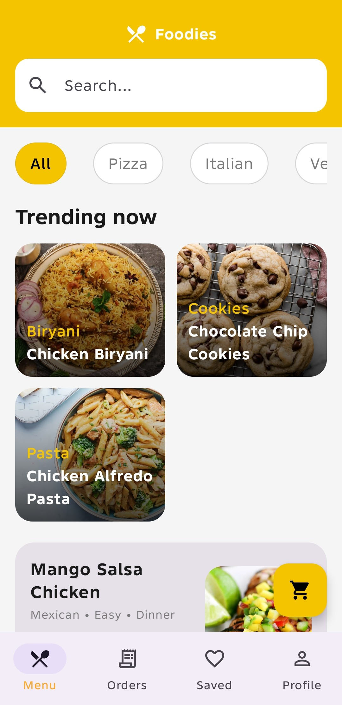
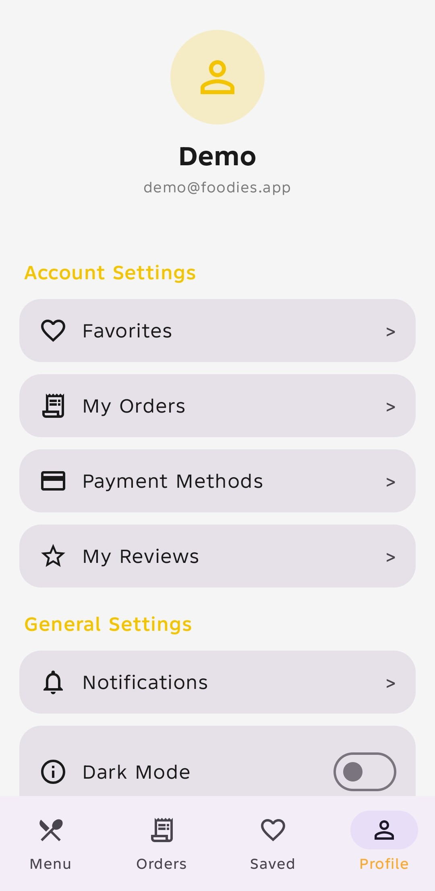

# Foodies Compose

A Jetpack Compose restaurant ordering app inspired by the provided Food Ordering System Figma kit and powered by the live DummyJSON Recipes API.

## Features

- Splash screen
- Fake login and signup with local session
- Home / menu dashboard
- Search and tag filtering
- Product detail with quantity, size, extras, and notes
- Favorites
- Cart
- Checkout
- Order success screen
- Local order history
- Profile, notifications, payment method, and reviews screens
- DataStore persistence for session, favorites, cart, orders, and dark mode

## Demo Login

- Email: `demo@foodies.app`
- Password: `1234`

## API

- Base URL: `https://dummyjson.com/`
- Docs: `https://dummyjson.com/docs/recipes`

## Screenshots

### Splash Screen

### App Logo / Loading Screen

### Home / Menu Screen

### Profile Screen
